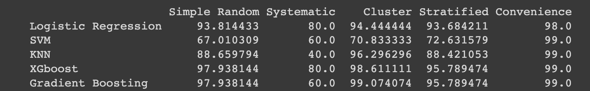

# Sampling-methods
In this python code, we have used sampling techniques on a credit card fraud detection dataset and then applied various ML models on the dataset to find out which Model,sampling technique combination gives us the best accuracy.

Following 5 sampling Techniques were used:

1.Simple Random
2.Systematic
3.Cluster
4.Stratified
5.Convenience
The Sample size was calculates using the following formula: n = Z^2(p(1 – p)/m^2) where: n = sample size Z = z-value (for 99% confidence interval, Z = 2.576) p = proportion of the minority class (taken as 0.5 for a balanced dataset) m = margin of error (taken as 0.05 for a sample size of 1000)

Following 5 models were applied on the sampled dataset:

1.Logistic Regression (M1)
2.Support Vector Machine (M2)
3.KNN (M3)
4.XGBoost Classifier (M4)
5.Gradient Boosting Classifier(M5)

On execution of the code, following results were obtained: The cells of the table represent accuracy of the applied model using the respective sampling technique.

